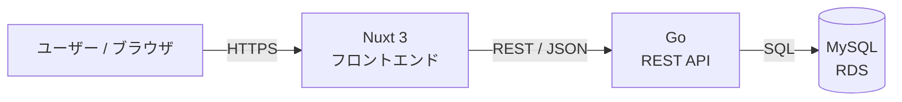
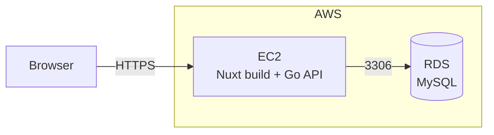

# アーキテクチャ設計書 — ExpenseTracker

[要件定義書](requirements.md)の非機能要件を基に、システム全体構成・ディレクトリ構成・設定/環境変数・デプロイ構成を定義する。本書は実装着手前の設計方針であり、具体的なライブラリ選定はスキャフォールド時に確定する。

---

## 1. システム構成（3層）



| 層 | 技術 | 役割 |
|----|------|------|
| フロントエンド | Nuxt 3 (Vue 3) | 画面表示・入力・グラフ描画。API をコール |
| バックエンド | Go | REST API、業務ロジック、バリデーション、集計 |
| データベース | MySQL (RDS) | 取引・カテゴリ・予算の永続化 |

- フロントとバックは **REST/JSON** で疎結合。CORS はバックエンドで許可オリジンを設定。
- 集計（`/api/summary`）はバックエンドで計算し、フロントは表示に専念。

---

## 2. リポジトリ / ディレクトリ構成

モノレポ構成（1リポジトリに front / back を同居）。

```text
expense-tracker/
├── docs/                      # 設計ドキュメント（本書を含む）
├── backend/                   # Go REST API
│   ├── cmd/server/            # エントリポイント（main.go）
│   ├── internal/
│   │   ├── handler/           # HTTP ハンドラ（ルーティング）
│   │   ├── service/           # 業務ロジック・バリデーション
│   │   ├── repository/        # DB アクセス（SQL）
│   │   └── model/             # ドメインモデル / DTO
│   ├── db/
│   │   ├── migrations/        # マイグレーション SQL
│   │   └── seeds/             # 初期データ
│   ├── go.mod
│   └── .env.example
├── frontend/                  # Nuxt 3
│   ├── pages/                 # ルーティング（画面）
│   ├── components/            # UI コンポーネント
│   ├── composables/           # API クライアント等の共通ロジック
│   ├── assets/ , public/
│   ├── nuxt.config.ts
│   ├── package.json
│   └── .env.example
└── README.md
```

- バックエンドは **handler → service → repository** のレイヤード構成で責務を分離。
- フロントは Nuxt の規約ベース（`pages/` で自動ルーティング、`composables/` に API 呼び出しを集約）。

### ライブラリ選定（スキャフォールド時に確定）

| 領域 | 候補 | 備考 |
|------|------|------|
| Go ルーター | net/http（標準, Go 1.22+）/ chi / Echo / Gin | 学習用なら標準 or chi が軽量 |
| Go DB アクセス | database/sql + sqlc / GORM | 型安全重視なら sqlc |
| マイグレーション | golang-migrate / sql-migrate | |
| フロント グラフ | Chart.js (vue-chartjs) / ECharts | F-3 の円/棒グラフ用 |
| フロント UI | 任意（最小構成 or UIライブラリ） | |

---

## 3. API クライアント / 通信方針

- フロントは `composables/useApi.ts`（仮）に fetch ラッパーを集約し、ベースURL（`/api`）・エラーハンドリングを共通化。
- 開発時はフロント(`localhost:3000`)からバック(`localhost:8080`)へアクセス。Nuxt の devProxy または CORS 許可で対応。
- エラーは [API 仕様書](api-spec.md) の共通エラー形式に従い、フロントで `error.code` を解釈して表示。

---

## 4. 設定 / 環境変数

`.env` はコミットしない（`.gitignore` 済み）。各ディレクトリに `.env.example` を用意する。

### バックエンド（`backend/.env.example`）

| 変数 | 例 | 説明 |
|------|----|------|
| `APP_PORT` | `8080` | API サーバーのポート |
| `DB_HOST` | `localhost` / RDS エンドポイント | MySQL ホスト |
| `DB_PORT` | `3306` | |
| `DB_NAME` | `expense_tracker` | |
| `DB_USER` | `app` | |
| `DB_PASSWORD` | `（秘匿）` | |
| `CORS_ALLOW_ORIGIN` | `http://localhost:3000` | 許可するフロントオリジン |
| `TZ` | `Asia/Tokyo` | タイムゾーン |

### フロントエンド（`frontend/.env.example`）

| 変数 | 例 | 説明 |
|------|----|------|
| `NUXT_PUBLIC_API_BASE` | `http://localhost:8080/api` | API のベースURL |

---

## 5. ローカル開発フロー（想定）

```text
# バックエンド
cd backend
cp .env.example .env        # 値を設定
# マイグレーション実行 → シード投入（ツールはスキャフォールド時に確定）
go run ./cmd/server

# フロントエンド
cd frontend
cp .env.example .env
npm install
npm run dev                  # http://localhost:3000
```

> 具体的なコマンドは確定後、CLAUDE.md の「プロジェクト固有コマンド」に追記する。

---

## 6. デプロイ構成（AWS）



- **EC2:** アプリケーション（Go API と Nuxt のビルド成果物）をホスト。
  - Nuxt は SSR または静的生成のうち、運用が簡単な方式をスキャフォールド時に選択。
  - リバースプロキシ（nginx 等）でフロント配信と `/api` の振り分けを行う構成を想定。
- **RDS:** MySQL を運用。EC2 のセキュリティグループからのみ 3306 を許可。
- **シークレット管理:** DB 認証情報は EC2 の環境変数 or AWS Secrets Manager（学習段階では環境変数で可）。

---

## 7. 非機能・運用上の方針

- **バリデーション:** フロント（入力時）とバック（API 受信時）の二重で実施。最終的な正当性はバックで担保。
- **ロギング:** バックエンドはリクエストログ・エラーログを標準出力に出す（CloudWatch 連携は将来検討）。
- **タイムゾーン:** アプリ全体で Asia/Tokyo を基準。日付は `DATE`、月は `YYYY-MM` で扱う（[DB 設計書](db-design.md) 参照）。
- **将来拡張:** 認証/マルチユーザー化に備え、データ層に `user_id` を追加しやすいレイヤード構成を維持する。
