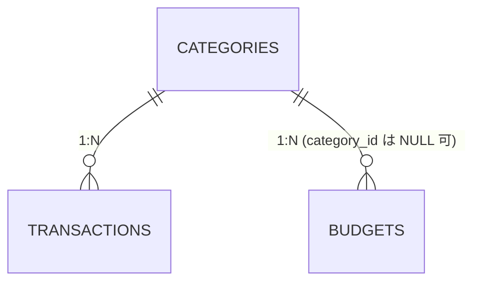

# DB 設計書 — ExpenseTracker

[要件定義書](requirements.md)のデータモデルを基に、MySQL の物理設計（DDL・インデックス・制約・シードデータ・命名規約）を定義する。

- **DBMS:** MySQL 8.x（AWS RDS）
- **文字セット:** `utf8mb4` / 照合順序 `utf8mb4_0900_ai_ci`
- **タイムゾーン:** アプリ側で Asia/Tokyo を扱う。DB には日時を UTC ではなく `DATETIME` として保存（単一ユーザー・学習用のため簡素化）。
- **金額:** 整数（円）。`INT`（最大約21億）で十分。

---

## 1. 命名規約

| 対象 | 規約 | 例 |
|------|------|----|
| テーブル名 | スネークケース・複数形 | `transactions` |
| カラム名 | スネークケース | `category_id` |
| 主キー | `id`（BIGINT, AUTO_INCREMENT） | `id` |
| 外部キー | `{参照テーブル単数}_id` | `category_id` |
| 外部キー制約名 | `fk_{table}_{column}` | `fk_transactions_category_id` |
| インデックス名 | `idx_{table}_{columns}` | `idx_transactions_occurred_on` |
| 一意制約名 | `uq_{table}_{columns}` | `uq_budgets_category_year_month` |
| 日時カラム | `created_at` / `updated_at` を全テーブルに付与 | |

---

## 2. テーブル定義（DDL）

### 2.1 `categories`

```sql
CREATE TABLE categories (
  id         BIGINT       NOT NULL AUTO_INCREMENT,
  name       VARCHAR(50)  NOT NULL,
  type       ENUM('income','expense') NOT NULL,
  created_at DATETIME     NOT NULL DEFAULT CURRENT_TIMESTAMP,
  updated_at DATETIME     NOT NULL DEFAULT CURRENT_TIMESTAMP ON UPDATE CURRENT_TIMESTAMP,
  PRIMARY KEY (id),
  UNIQUE KEY uq_categories_name_type (name, type)
) ENGINE=InnoDB DEFAULT CHARSET=utf8mb4 COLLATE=utf8mb4_0900_ai_ci;
```

- `uq_categories_name_type`: 同一種別内でのカテゴリ名重複を禁止。

### 2.2 `transactions`

```sql
CREATE TABLE transactions (
  id          BIGINT       NOT NULL AUTO_INCREMENT,
  occurred_on DATE         NOT NULL,
  amount      INT          NOT NULL,
  type        ENUM('income','expense') NOT NULL,
  category_id BIGINT       NOT NULL,
  memo        VARCHAR(255) NULL,
  created_at  DATETIME     NOT NULL DEFAULT CURRENT_TIMESTAMP,
  updated_at  DATETIME     NOT NULL DEFAULT CURRENT_TIMESTAMP ON UPDATE CURRENT_TIMESTAMP,
  PRIMARY KEY (id),
  KEY idx_transactions_occurred_on (occurred_on),
  KEY idx_transactions_category_id (category_id),
  CONSTRAINT fk_transactions_category_id
    FOREIGN KEY (category_id) REFERENCES categories (id),
  CONSTRAINT chk_transactions_amount CHECK (amount > 0)
) ENGINE=InnoDB DEFAULT CHARSET=utf8mb4 COLLATE=utf8mb4_0900_ai_ci;
```

- `idx_transactions_occurred_on`: 月別一覧・集計のための範囲検索用。
- `chk_transactions_amount`: 金額は正の整数。
- 整合性ルール: `transactions.type` は `categories.type` と一致させる（アプリ層で検証。DB の CHECK では参照テーブルを跨げないため）。

### 2.3 `budgets`

```sql
CREATE TABLE budgets (
  id          BIGINT   NOT NULL AUTO_INCREMENT,
  category_id BIGINT   NULL,
  year_month  CHAR(7)  NOT NULL,           -- 'YYYY-MM'
  amount      INT      NOT NULL,
  created_at  DATETIME NOT NULL DEFAULT CURRENT_TIMESTAMP,
  updated_at  DATETIME NOT NULL DEFAULT CURRENT_TIMESTAMP ON UPDATE CURRENT_TIMESTAMP,
  PRIMARY KEY (id),
  KEY idx_budgets_year_month (year_month),
  CONSTRAINT fk_budgets_category_id
    FOREIGN KEY (category_id) REFERENCES categories (id),
  CONSTRAINT chk_budgets_amount CHECK (amount > 0)
) ENGINE=InnoDB DEFAULT CHARSET=utf8mb4 COLLATE=utf8mb4_0900_ai_ci;
```

- `category_id` が `NULL` の行は「月全体予算」を表す。
- **重複防止に関する注意:** MySQL の `UNIQUE KEY` は `NULL` を重複とみなさないため、`(category_id, year_month)` の一意制約だけでは「月全体予算」の重複を防げない。
  - 対応方針: **アプリ層で重複登録を防止**（同一 `year_month` の月全体予算は1件まで）し、カテゴリ別予算には一意制約を付与する。
  - 代替案（実装時に検討）: 月全体を表す番兵カテゴリを用意して `NOT NULL` 化する。
- カテゴリ別予算の一意制約（任意適用）:

```sql
ALTER TABLE budgets
  ADD UNIQUE KEY uq_budgets_category_year_month (category_id, year_month);
```

---

## 3. リレーション



- `transactions.category_id` → `categories.id`（必須）
- `budgets.category_id` → `categories.id`（NULL 可 = 月全体予算）
- 削除ポリシー: カテゴリ削除は、紐づく取引・予算が存在する場合は **RESTRICT（削除不可）**。FK はデフォルトの RESTRICT 動作とする。

---

## 4. 初期シードデータ

アプリ初回セットアップ時に投入する初期カテゴリ。

```sql
INSERT INTO categories (name, type) VALUES
  -- 支出
  ('食費',     'expense'),
  ('日用品',   'expense'),
  ('交通費',   'expense'),
  ('住居費',   'expense'),
  ('水道光熱費','expense'),
  ('娯楽費',   'expense'),
  ('交際費',   'expense'),
  ('医療費',   'expense'),
  ('その他',   'expense'),
  -- 収入
  ('給与',     'income'),
  ('賞与',     'income'),
  ('副収入',   'income'),
  ('その他',   'income');
```

---

## 5. マイグレーション方針

- マイグレーションはバージョン管理されたSQLファイルで行う（ツールはスキャフォールド時に確定。例: golang-migrate / sql-migrate）。
- ディレクトリ案: `backend/db/migrations/` に `0001_create_categories.up.sql` / `.down.sql` の形式で配置。
- シードは `backend/db/seeds/` に分離し、開発環境セットアップ時に投入。

---

## 6. 代表的なクエリ（集計の参考）

当月のカテゴリ別支出合計（`/api/summary` で使用）:

```sql
SELECT c.id, c.name, SUM(t.amount) AS total
FROM transactions t
JOIN categories c ON c.id = t.category_id
WHERE t.type = 'expense'
  AND t.occurred_on BETWEEN '2026-06-01' AND '2026-06-30'
GROUP BY c.id, c.name
ORDER BY total DESC;
```

当月の収入・支出合計:

```sql
SELECT type, SUM(amount) AS total
FROM transactions
WHERE occurred_on BETWEEN '2026-06-01' AND '2026-06-30'
GROUP BY type;
```
