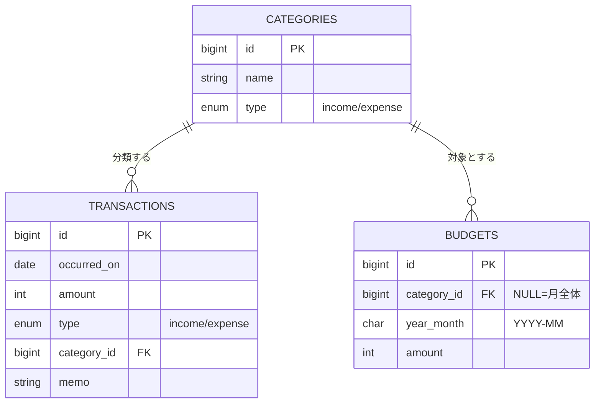
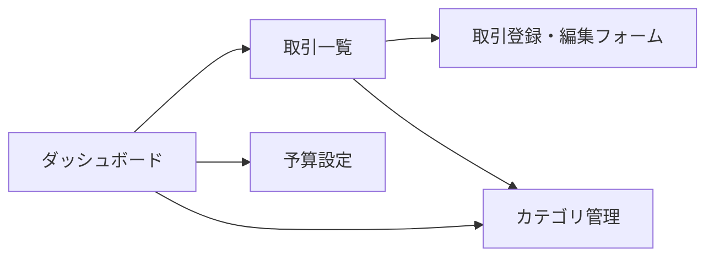

# 要件定義書 — ExpenseTracker（家計簿アプリ）

学習用課題として開発する家計簿アプリの要件をまとめる。実装着手前の合意形成を目的とし、確定後はこのドキュメントを基にスキャフォールド・実装を進める。

---

## 1. 概要 / 目的

- **目的:** 日々の収入・支出を記録し、月別・カテゴリ別に可視化することで家計を把握できるようにする。
- **位置づけ:** 学習用課題。これまで使ったことのない技術スタック（Nuxt 3 / Go / MySQL）の習得を兼ねる。
- **利用形態:** **単一ユーザー前提**（ログイン認証は今回のスコープ外）。ローカル／個人環境での利用を想定する。
- **デプロイ:** アプリは AWS EC2、データベースは AWS RDS（MySQL）。

### スコープ（今回作るもの）

| # | コア機能 | 概要 |
|---|----------|------|
| F-1 | 収支記録 | 収入・支出の登録／一覧／編集／削除（CRUD） |
| F-2 | カテゴリ管理 | カテゴリの追加／編集／削除 |
| F-3 | 集計・グラフ表示 | 月別・カテゴリ別の集計とグラフ可視化 |
| F-4 | 予算設定・通知 | 予算の設定と、超過／接近時のアプリ内アラート |

---

## 2. 機能要件

### F-1 収支記録

- 取引（トランザクション）を登録・一覧・編集・削除できる。
- 取引が持つ項目:
  - **日付**（必須）: 取引が発生した日（`occurred_on`）
  - **金額**（必須）: 正の整数（円）。小数は扱わない
  - **種別**（必須）: `income`（収入）/ `expense`（支出）
  - **カテゴリ**（必須）: カテゴリを1つ選択
  - **メモ**（任意）: 自由記述
- 一覧は対象月での絞り込み、日付の新しい順表示を基本とする。
- バリデーション: 金額は1以上、日付は有効な日付、カテゴリは存在するもの、を必須とする。

### F-2 カテゴリ管理

- カテゴリを追加・編集・削除できる。
- カテゴリは**種別（収入用 / 支出用）**を持ち、取引登録時は種別に合うカテゴリのみ選択できる。
- 取引で使用中のカテゴリの削除時の扱い: 削除を禁止する（または「未分類」へ付け替え）方針とし、実装時に確定する。
- アプリ初期化時に**初期カテゴリをシード**する（例: 支出＝食費・日用品・交通費・住居費・娯楽費 / 収入＝給与・その他）。

### F-3 集計・グラフ表示

- ダッシュボードで当月のサマリを表示する:
  - 当月の収入合計・支出合計・収支差（バランス）
  - **カテゴリ別支出の構成**（円グラフ）
  - **月別の収支推移**（棒グラフ／折れ線）
- 対象月を切り替えて表示できる。
- 集計はサーバー側（Go API）で計算して返すことを基本とする。

### F-4 予算設定・通知

- 予算を設定できる:
  - **対象月（YYYY-MM）**ごとに、**カテゴリ別**または**月全体**の予算金額を設定
- 実績（当月の支出合計）が予算に対して以下の状態になった場合、アプリ内にアラートを表示する:
  - **接近**: 予算の一定割合（例: 80%）を超えた
  - **超過**: 予算を超えた
- 通知はアプリ内表示（バナー／ダッシュボード上の進捗バー）とする。メール・プッシュ通知はスコープ外。

---

## 3. 非機能要件

- **アーキテクチャ:** Nuxt 3（フロント）↔ Go REST API（バックエンド）↔ MySQL の3層構成。
- **認証:** なし（単一ユーザー）。将来のマルチユーザー化に備え、データ層に `user_id` を追加できる構造を意識する。
- **金額の扱い:** 整数（円）。通貨は日本円（JPY）固定。
- **文字コード:** UTF-8。日本語入力に対応。
- **タイムゾーン:** Asia/Tokyo を基準とする。
- **対応ブラウザ:** モダンブラウザ最新版（Chrome / Safari / Firefox / Edge）。
- **レスポンス目安:** 通常操作（一覧・登録・集計）は体感1秒以内を目標。
- **データ整合性:** 金額・種別・必須項目のバリデーションをフロント・サーバー双方で行う。
- **セキュリティ/運用:** `.env` などの秘匿情報はコミットしない（`.gitignore` 済み）。

---

## 4. データモデル（論理設計）

### テーブル定義

#### `categories`（カテゴリ）

| カラム | 型 | 制約 | 説明 |
|--------|----|------|------|
| id | BIGINT | PK, AUTO_INCREMENT | |
| name | VARCHAR | NOT NULL | カテゴリ名 |
| type | ENUM('income','expense') | NOT NULL | 収入用 / 支出用 |
| created_at | DATETIME | NOT NULL | |
| updated_at | DATETIME | NOT NULL | |

#### `transactions`（取引）

| カラム | 型 | 制約 | 説明 |
|--------|----|------|------|
| id | BIGINT | PK, AUTO_INCREMENT | |
| occurred_on | DATE | NOT NULL | 取引発生日 |
| amount | INT | NOT NULL, > 0 | 金額（円） |
| type | ENUM('income','expense') | NOT NULL | 種別 |
| category_id | BIGINT | NOT NULL, FK → categories.id | カテゴリ |
| memo | VARCHAR | NULL | メモ（任意） |
| created_at | DATETIME | NOT NULL | |
| updated_at | DATETIME | NOT NULL | |

#### `budgets`（予算）

| カラム | 型 | 制約 | 説明 |
|--------|----|------|------|
| id | BIGINT | PK, AUTO_INCREMENT | |
| category_id | BIGINT | NULL, FK → categories.id | NULL の場合は「月全体」予算 |
| year_month | CHAR(7) | NOT NULL | 対象月（`YYYY-MM`） |
| amount | INT | NOT NULL, > 0 | 予算金額（円） |
| created_at | DATETIME | NOT NULL | |
| updated_at | DATETIME | NOT NULL | |

- 一意制約（想定）: `budgets(category_id, year_month)` の組み合わせで重複を防ぐ。

### ER 図

---

## 5. 画面一覧

| 画面 | 主な内容 | 関連機能 |
|------|----------|----------|
| ダッシュボード | 当月の収支サマリ、カテゴリ別/月別グラフ、予算進捗 | F-3, F-4 |
| 取引一覧 | 月別の取引リスト、絞り込み、編集・削除導線 | F-1 |
| 取引登録・編集フォーム | 日付・金額・種別・カテゴリ・メモの入力 | F-1 |
| カテゴリ管理 | カテゴリの追加・編集・削除 | F-2 |
| 予算設定 | 月・カテゴリ（または月全体）ごとの予算入力 | F-4 |

### 画面遷移（概要）

---

## 6. REST API 概要

ベースパス: `/api`。レスポンスは JSON。金額は整数（円）。

| メソッド | パス | 説明 |
|----------|------|------|
| GET | `/api/transactions?year_month=YYYY-MM` | 取引一覧（対象月で絞り込み） |
| POST | `/api/transactions` | 取引の新規登録 |
| GET | `/api/transactions/{id}` | 取引の取得 |
| PUT | `/api/transactions/{id}` | 取引の更新 |
| DELETE | `/api/transactions/{id}` | 取引の削除 |
| GET | `/api/categories?type=income\|expense` | カテゴリ一覧（種別で絞り込み可） |
| POST | `/api/categories` | カテゴリの追加 |
| PUT | `/api/categories/{id}` | カテゴリの更新 |
| DELETE | `/api/categories/{id}` | カテゴリの削除 |
| GET | `/api/budgets?year_month=YYYY-MM` | 予算一覧（対象月） |
| POST | `/api/budgets` | 予算の設定 |
| PUT | `/api/budgets/{id}` | 予算の更新 |
| DELETE | `/api/budgets/{id}` | 予算の削除 |
| GET | `/api/summary?year_month=YYYY-MM` | 集計（収入/支出合計、カテゴリ別内訳、予算進捗） |

---

## 7. スコープ外 / 将来拡張

今回のスコープには含めないが、将来的に検討しうるもの:

- **ユーザー認証・マルチユーザー対応**（各テーブルへの `user_id` 追加、ログイン機能）
- **繰り返し取引**（毎月の固定費の自動登録）
- **CSV インポート / エクスポート**
- **メール・プッシュ通知**（予算アラートの外部通知）
- **複数通貨対応**
- **タグ付け・検索の高度化**

---

## 8. 用語集

| 用語 | 意味 |
|------|------|
| 取引（Transaction） | 1件の収入または支出の記録 |
| 種別（Type） | 取引・カテゴリが収入(`income`)か支出(`expense`)かの区分 |
| 予算（Budget） | 対象月・カテゴリ（または月全体）に対して設定する上限金額 |
| 収支バランス | 対象期間の「収入合計 − 支出合計」 |
