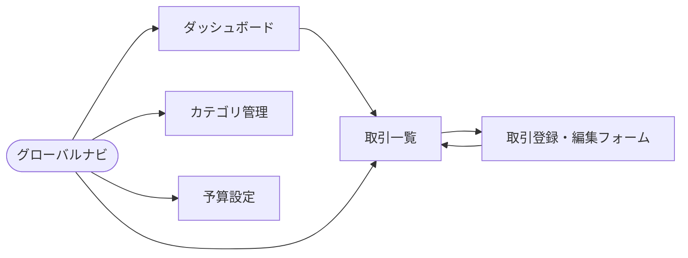

# 画面設計書 — ExpenseTracker

[要件定義書](requirements.md)の「画面一覧」を基に、各画面のワイヤーフレーム・UI要素・入力バリデーション・画面遷移・利用APIを定義する。ワイヤーフレームはレイアウトの意図を示す概略であり、最終的な見た目はスキャフォールド後に調整する。

- **対象:** 単一ユーザー（ログインなし）
- **利用API:** [API 仕様書](api-spec.md) を参照
- **画面構成:** 共通ヘッダー＋グローバルナビゲーション＋各ページ本体

---

## 1. 共通レイアウト

```text
┌────────────────────────────────────────────────┐
│  ExpenseTracker        [ ◀ 2026-06 ▶ ]   月選択 │  ← 共通ヘッダー
├────────────────────────────────────────────────┤
│ [ダッシュボード] [取引] [カテゴリ] [予算]        │  ← グローバルナビ
├────────────────────────────────────────────────┤
│                                                  │
│                 （各ページ本体）                  │
│                                                  │
└────────────────────────────────────────────────┘
```

- **月セレクタ（ヘッダー）:** 当月を基準に前後の月へ移動。選択中の `year_month` は全画面で共有し、一覧・集計・予算の表示対象を切り替える。
- **ナビ:** ダッシュボード / 取引 / カテゴリ / 予算 の4メニュー。
- **共通の状態表示:**
  - ローディング: 各データ取得中はスピナー/スケルトンを表示。
  - エラー: API エラー時はバナーで `error.message` を表示。
  - 空状態: データ0件時は「データがありません」と登録導線を表示。

### 画面遷移図



---

## 2. ダッシュボード（F-3 / F-4）

当月サマリ・グラフ・予算進捗を表示するトップ画面。

```text
┌────────────────────────────────────────────────┐
│ サマリ（2026-06）                                 │
│  収入 ¥250,000  支出 ¥182,300  収支 +¥67,700     │
├──────────────────────┬─────────────────────────┤
│ カテゴリ別支出（円）  │ 月別収支推移（棒）         │
│   ◔ 食費 41,200      │   ▆ ▅ ▇ ▃ ▆ ▇            │
│   ◔ 交通費 12,800    │   3  4  5  6 ...          │
│   ...                │                           │
├──────────────────────┴─────────────────────────┤
│ 予算進捗                                          │
│  食費    ████████░░ 103%  ⚠ 超過 (40,000)       │
│  月全体  ████████▓░ 122%  ⚠ 超過 (150,000)      │
│  娯楽費  ████░░░░░░  45%   OK   (20,000)         │
└────────────────────────────────────────────────┘
```

| UI要素 | 内容 | データ元 |
|--------|------|----------|
| サマリ | 収入合計・支出合計・収支差 | `GET /api/summary` → `totals` |
| カテゴリ別支出（円グラフ） | カテゴリ別の支出構成 | `summary.expense_by_category` |
| 月別収支推移（棒グラフ） | 直近数ヶ月の収支 | 月別に `summary` を複数取得（または将来の集計API拡張） |
| 予算進捗バー | 予算に対する消化率と状態 | `summary.budget_progress` |

- **予算アラート表示（F-4）:** `budget_progress[].status` に応じて配色・アイコンを変える。
  - `over`（>100%）: 赤・⚠「超過」
  - `near`（既定80%以上）: 黄・「まもなく超過」
  - `under`: 通常色・「OK」
- 予算未設定のカテゴリは進捗に表示しない。

---

## 3. 取引一覧（F-1）

選択中の月の取引をリスト表示する。

```text
┌────────────────────────────────────────────────┐
│ 取引一覧（2026-06）          [＋ 新規登録]        │
│ 絞り込み: [種別 ▾][カテゴリ ▾]                    │
├────────────────────────────────────────────────┤
│ 日付       カテゴリ   メモ        金額    操作    │
│ 06/18     食費       ランチ    -¥1,280  [✎][🗑]  │
│ 06/15     給与       6月分   +¥250,000  [✎][🗑]  │
│ 06/14     交通費     定期      -¥9,800  [✎][🗑]  │
│ ...                                              │
└────────────────────────────────────────────────┘
```

| UI要素 | 内容 | データ元 |
|--------|------|----------|
| 新規登録ボタン | 取引登録フォームへ遷移 | — |
| 絞り込み | 種別 / カテゴリ | `GET /api/transactions?type=&category_id=` |
| 一覧行 | 日付・カテゴリ・メモ・金額（支出は−、収入は＋で色分け） | `GET /api/transactions?year_month=` |
| 編集 [✎] | 取引編集フォームへ遷移 | — |
| 削除 [🗑] | 確認ダイアログ後に削除 | `DELETE /api/transactions/{id}` |

- 並び順: 日付の新しい順。
- 削除は誤操作防止のため確認ダイアログを挟む。

---

## 4. 取引登録・編集フォーム（F-1）

新規登録と編集で共用するフォーム。

```text
┌────────────────────────────────────────────────┐
│ 取引の登録 / 編集                                 │
├────────────────────────────────────────────────┤
│ 種別      (●) 支出  ( ) 収入                      │
│ 日付      [ 2026-06-18 ]                          │
│ 金額      [ 1280            ] 円                  │
│ カテゴリ  [ 食費 ▾ ]   ← 種別に応じて候補が変化   │
│ メモ      [ ランチ                            ]  │
├────────────────────────────────────────────────┤
│                       [ キャンセル ] [ 保存 ]     │
└────────────────────────────────────────────────┘
```

| フィールド | 入力 | バリデーション |
|------------|------|----------------|
| 種別 | ラジオ（支出/収入） | 必須 |
| 日付 | 日付ピッカー | 必須・有効な日付 |
| 金額 | 数値 | 必須・整数・1以上 |
| カテゴリ | セレクト（**選択中の種別に一致するカテゴリのみ**） | 必須 |
| メモ | テキスト | 任意・255文字以内 |

- **種別を切り替えるとカテゴリ候補を再取得**（`GET /api/categories?type=`）し、不一致の選択をクリア。
- 保存: 新規は `POST /api/transactions`、編集は `PUT /api/transactions/{id}`。
- バリデーションエラーは各フィールド下に表示（API の `error.details[].field` と対応）。
- 保存成功後は取引一覧へ戻る。

---

## 5. カテゴリ管理（F-2）

カテゴリの追加・編集・削除を行う。

```text
┌────────────────────────────────────────────────┐
│ カテゴリ管理                     [＋ 追加]         │
│ タブ: [ 支出 ] [ 収入 ]                           │
├────────────────────────────────────────────────┤
│ 名称           操作                               │
│ 食費          [✎][🗑]                            │
│ 日用品        [✎][🗑]                            │
│ 交通費        [✎][🗑]                            │
│ ...                                              │
└────────────────────────────────────────────────┘
```

| UI要素 | 内容 | データ元 |
|--------|------|----------|
| タブ（支出/収入） | 種別で絞り込み表示 | `GET /api/categories?type=` |
| 追加 | 名称・種別を入力して作成 | `POST /api/categories` |
| 編集 [✎] | 名称を変更 | `PUT /api/categories/{id}` |
| 削除 [🗑] | 確認後に削除 | `DELETE /api/categories/{id}` |

| フィールド | バリデーション |
|------------|----------------|
| 名称 | 必須・50文字以内・同一種別内で重複不可（409 はメッセージ表示） |
| 種別 | 必須（追加時） |

- **使用中カテゴリの削除:** 取引・予算で使用中の場合、API が 409 を返す。UI は「使用中のため削除できません」を表示。

---

## 6. 予算設定（F-4）

選択中の月に対する予算を設定する。

```text
┌────────────────────────────────────────────────┐
│ 予算設定（2026-06）              [＋ 追加]         │
├────────────────────────────────────────────────┤
│ 対象            予算額        操作                 │
│ 月全体         ¥150,000     [✎][🗑]              │
│ 食費           ¥40,000      [✎][🗑]              │
│ 娯楽費         ¥20,000      [✎][🗑]              │
│ ...                                              │
├────────────────────────────────────────────────┤
│ 追加フォーム                                      │
│ 対象  [ 月全体 / カテゴリ ▾ ]  金額 [      ] 円   │
└────────────────────────────────────────────────┘
```

| UI要素 | 内容 | データ元 |
|--------|------|----------|
| 予算一覧 | 当月の予算（月全体＋カテゴリ別） | `GET /api/budgets?year_month=` |
| 追加 | 対象（月全体 or 支出カテゴリ）＋金額 | `POST /api/budgets` |
| 編集 [✎] | 金額を変更 | `PUT /api/budgets/{id}` |
| 削除 [🗑] | 確認後に削除 | `DELETE /api/budgets/{id}` |

| フィールド | バリデーション |
|------------|----------------|
| 対象 | 月全体（category_id 省略）または支出カテゴリ |
| 金額 | 必須・整数・1以上 |
| （重複） | 同一 `(対象, 当月)` の予算は1件まで（409 はメッセージ表示） |

- 設定した予算はダッシュボードの「予算進捗」に反映される。

---

## 7. 共通のインタラクション方針

- **確認ダイアログ:** 削除操作は必ず確認を挟む。
- **エラー表示:** フォームはフィールド単位、一覧はページ上部バナー。
- **金額表示:** 3桁区切り・円記号付き。支出は「−」、収入は「＋」で色分け。
- **月の共有:** ヘッダーの月セレクタが全画面の表示対象月を制御する。
- **レスポンシブ:** PC を主対象としつつ、ナビ・一覧はモバイル幅でも崩れないことを目標（詳細はスキャフォールド後に調整）。
